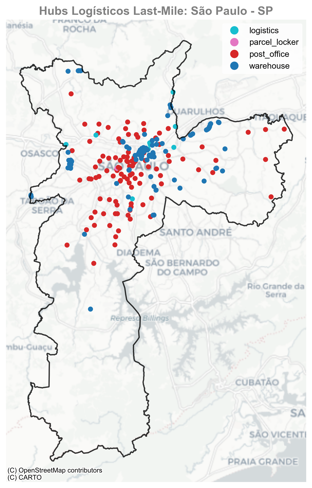

# 🗺️ Mapeando Hubs Logísticos Last-Mile com Python e GeoPandas

Este projeto mostra como **extrair, analisar e visualizar dados geoespaciais** para mapear hubs logísticos last-mile, utilizando bibliotecas do ecossistema Python.

A ideia é demonstrar uma abordagem prática para **e-commerce e operações logísticas**, identificando pontos estratégicos de distribuição a partir de dados do OpenStreetMap.

---

## ✅ O que você vai encontrar

* Como extrair dados do OpenStreetMap usando **OSMnx**
* Como manipular e visualizar dados geoespaciais com **GeoPandas**
* Um exemplo real: **mapeamento de hubs logísticos em São Paulo**

---

## 🛠️ Tecnologias utilizadas

*  **Python 3.13+**
*  [OSMnx](https://osmnx.readthedocs.io/en/stable/)
*  [GeoPandas](https://geopandas.org/)
*  [Matplotlib](https://matplotlib.org/)

---

## ▶️ Como rodar o projeto

1. **Clone este repositório**

   ```bash
   git clone https://github.com/manoelcastront/geopandas-dataviz.git
   cd nome-do-repo
   ```
2. **Crie um ambiente virtual e ative**

   ```bash
   python -m venv venv
   source venv/bin/activate   # Linux/Mac
   venv\Scripts\activate      # Windows
   ```
3. **Instale as dependências**

   ```bash
   pip install -r requirements.txt
   ```
4. **Execute o notebook**

   ```bash
   jupyter notebook
   ```

   Abra o arquivo `mapeando_hubs.ipynb`.

---

## 📊 Exemplo de visualização

Aqui está um exemplo do que você vai gerar:


---

## 📌 Próximos passos

* **Cruzar os hubs logísticos com dados populacionais, demanda e tempos de entrega** para identificar se a cobertura atual atende às regiões com maior concentração de clientes.
* **Responder perguntas estratégicas**, como: *vale a pena abrir novos hubs em áreas específicas*?
* **Refinar as tags no OpenStreetMap** para melhorar a precisão da coleta de dados.
* **Integrar outras bases**, como dados empresariais do IBGE, para análises mais completas e segmentadas.
---

## 🔗 Artigo relacionado

Quer entender os conceitos por trás do projeto? Leia o artigo completo:
➡ [Como mapear hubs logísticos last-mile com Python e GeoPandas](link-do-artigo)